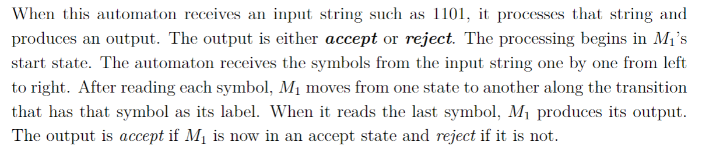

January 18, 2023

What is an automota?

Name the following automota $M_1$

This is an example- basically a set of states and transitions. A good example would be traffic lights- green/yellow/red are the states.

$q_1$, $q_2$, and $q_3$ are the states of this automota. $q_1$ is called the start state, $q_2$ is an accept state. If you passed $q_1$ a 0, it would go to itself along that directed loop edge, give it 1 it goes to $q_2$ etc.

The code `0 1 1 0` would take us from $q_1$ to $q_3$. $q_3$ is not a terminal state, so $0110 \notin L(M_1)$,
or `0110` does not belong to the language of $M_1$. This reveals a use of automota- we can check if strings belong to a language.

What are some strings that belong to $M_1$?

`0* 1` works because starting in $q_1$ we loop as many times as we want with 0, and then a single 1 terminates in $q_2$. `[0* 1 1*]` also works, as well as the more complicated `[0* 1 {1* 0 {0,1} }*`] covers many more cases.

<h3> Definition 5.1 </h3>

A finite automoton is a 5-tuple defined as ($Q$, $\sum$, $\delta$, $q_0$, $F$)
1. $Q$ is a finite set called the states
2. $\sum$ is a finite set called the alphabet
3. $\delta : Q \times \sum \rightarrow Q$ is the transition function
4. $q_0 \in Q$ is the start state
5. $F \subset Q$ is the subset of accept states

If A is the set of all strings accepted by $M_1$ we say A is the language of M, $L(M_1) = A$.

<h3> Definition of Delta *</h3>

$\epsilon$ is the empty string- a language may include the empty string. $\epsilon$ has length 0.

Some notes on $\epsilon$ :
$\delta(q, \epsilon) = q$ and $\delta(q_0, \epsilon) = q_0$

<h3>Extending the Alphabet</h3>
We can extend the alphabet of M without changing the language we already recognize.

This is useful to combine two automaton. In the easiest case, you basically create a "dummy" state to send the new member of the language to.

In our original example $M_1$, we can create $M_2$ s.t. it is exactly the same, then add a new state $q_4$ as below.

This $M_2$ will accept the same language as $M_1$ as well as accept the string 2. So, it is an extended language rather than an entirely new one.

The above images were generated using JFLAP, openable as a `.jff` [here](obsidian://open?vault=CIS%202111&file=Lecture%201%2FM1.jff).