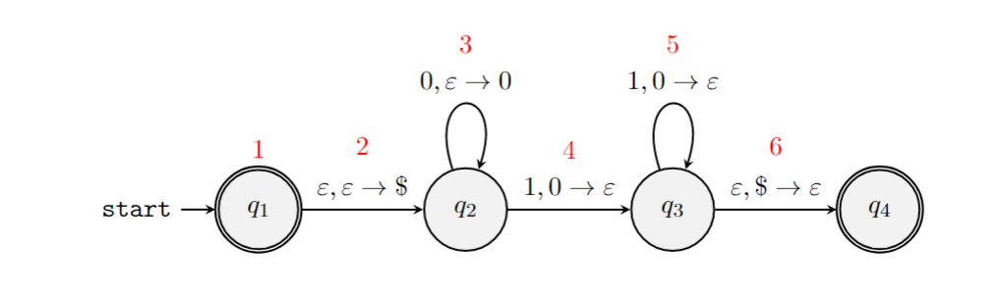
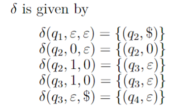
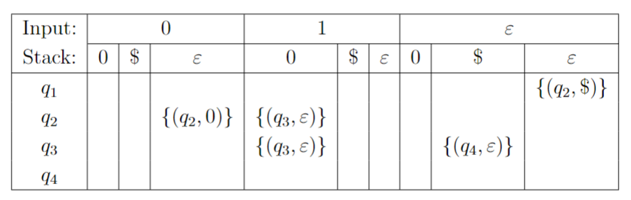

February 13th, 2023

$L(M_1) = A$ and $L(M_2) = B$, both of which are *regular* languages ($M_1$ and $M_2$ are DFAs). 

We know that the unions and complements of two regular languages is in fact regular. Is the same true for intersections?

$\overline{A} \cup \overline{B}$ is regular.

Then, $\overline{\overline{A} \cup \overline{B}} = \overline{\overline{A}} \cap \overline{\overline{B}} = A \cap B$, thus $A \cap B$ is regular.

$M_1 = \left\{ Q = \{q_1 \dots q_i\} ,\sum, \delta_1, q_1, F_1 \right\}$
$M_2 = \left \{ Q = \{r_1\dots r_j\}, \sum, \delta_2., r_1, F_2 \right \}$

So, if we want some $M \ni L(M) = A \cup B$, we get this:
$\delta^*(q_1, r_1, w) = \left( d_1^*(q_1, w), d_2^*(r_1, w) \right)$
 So, clearly, we accept a string $w$ if we end up in $F_1 \cup F_2$.
 Similarly for intersection, we end up in $F_1 \cap F_2$.

### Mechanics of PDA

Let's look at an example of a PDA whose language looks like $\{0^n 1^n\}$.

First, note that $\epsilon$ is in $L$, so $q_1$ must be an accept state. Then, we initialize the stack by pushing some symbol (in this case \$) to initialize the stack, and move to a new state $q_2$. Now in $q_2$, whenever we read a $0$ we push it onto the stack and stay in $q_2$. Finally, we read a $1$- this causes us to pop a $0$ off the stack and move into $q_3$. Now, we loop as we read $1$, each time popping a $0$. Finally, we will reach the end of the string or a $0$ and attempt to pop our \$ off the stack and move into our final (accepting) state, $q_4$.

$000111 \overset{start}{\rightarrow} q_1 \overset{\text{push \$ onto stack}}{\rightarrow} q_2 \overset{\text{push 3 0s onto the stack}}{\rightarrow} q_2 \times 3 \overset{\text{pop 3 0s off the stack}}{\rightarrow} q_3 \times 3 \rightarrow q_4$
This string is accepted.

Here is a formal description of $M$:
$M = \left ( Q, \sum, \Gamma, \delta, q_1, \$, F \right)$ with
$$
Q = \{q_1, q_2, q_3, q_4\} \\
\sum = \{0, 1\} \\
\Gamma = \{0, \$\} \\
F = \{q_1, q_4\} \\
$$
$\delta$ can be described in two ways:

Note that blank column entries signify $\emptyset$.   

