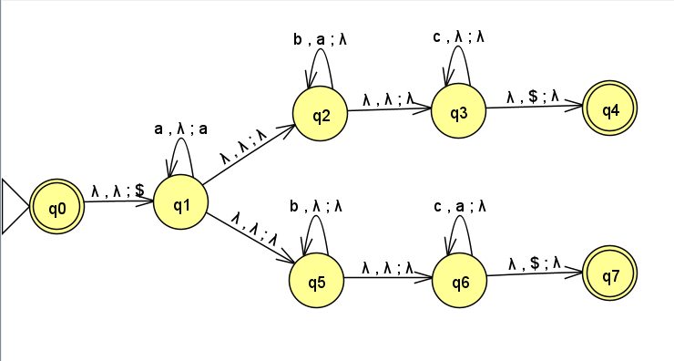

February 15th, 2023

Starting with a NFA -> DFA example.

The process for doing this as follows: 

Start in the initial state $q_0$
Where does 0 take us from $q_0$? $\{q_0, q_1\}$
Create new state $\{q_0, q_1\}$ and link $q_0 \overset{0}{\rightarrow} \{q_0, q_1\}$
Where does $1$ take us from $q_0$? $\{q_1\}$
Create new state $\dots$
Repeat until all state are exhausted AND EVERY STATE HAS A PATH FOR EVERY MEMBER OF THE ALPHABET!!! When a state in an NFA goes nowhere for a given letter, create a NULL state and link it (as seen above for $q_2$).

Now here is an example of building a PDA from a non-regular language:
$L(M) = \{a^nb^{2n} | n \geq 2\}$
M:

Note that $q_0$ is an accept state because $\epsilon = a^0b^{2*0}$ is an acceptable string.

Multiple character input allows us to simplify this automota to only 4 states:

A final example of a PDA recognizing the following language:
$L(M) = \{a^ib^jc^k | i,j,k \geq 0 \land i=j \lor i=k\}$ 

This is an example of a non-deterministic pushdown automota. The multiple $\epsilon$ moves make this non-deterministic.

Some Notes:

Every regular language is context-free, as they do not have a stack.
A language is context free if and only if a pushdown automota recognizes it.