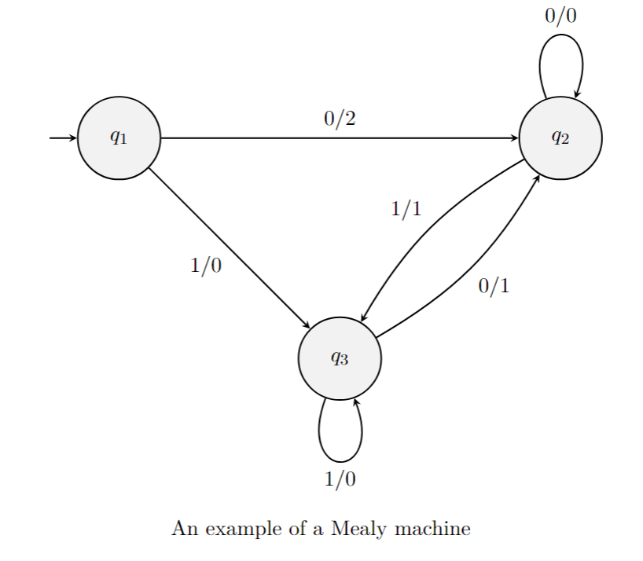
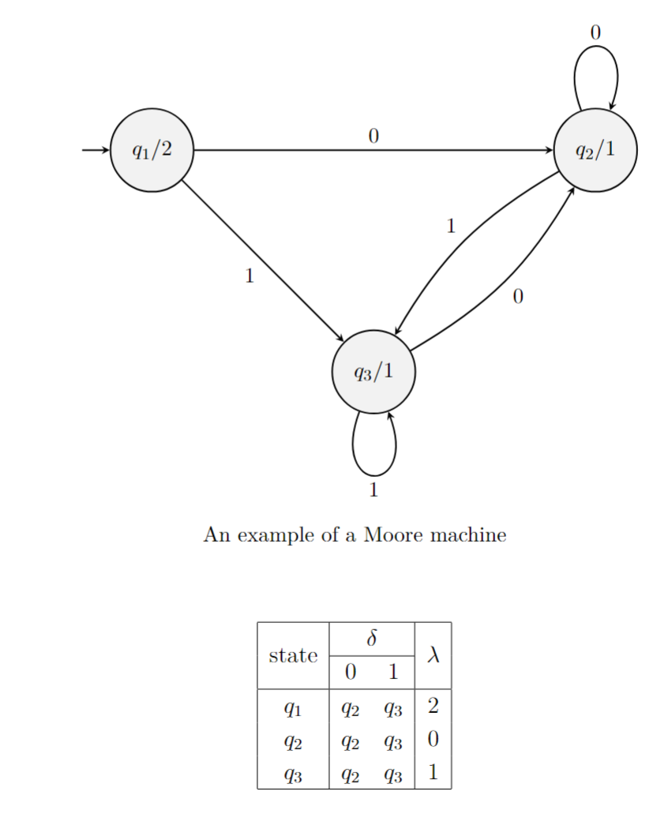
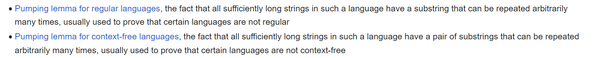

Febrauary 17th, 2023

### Mealy Machine

A *Mealy Machine* is a 6-tuple $M = \left ( Q, q_0, \sum, \Gamma, \delta, \lambda \right)$. $\Gamma$ is the output alphabet, and $\lambda$ is called the output function. The important thing about Mealy Machines is that each transition outputs a value. $\frac{a}{b}$ represents the transition and output, with $a$ being the transition and $b$ being the output value.

### Moore Machine

Related to *Mealy Machines* are *Moore Machines*. These are defined identically to *Mealy Machines*, except the output values are associated with states rather than transitions.

Importantly, all *Mealy Machines* can be converted to *Moore Machines*.

### Pumping Lemma for Context-Free Languages

If $A$ is a  context-free language, then there is a number $p$ (the pumping length) where, if $s \in A \ni |s| \geq p$, then $s$ may be divided into 5 pieces $s = uvxyz$, satisfying the following conditions:

1. For each $i \geq 0, \thinspace uv^ixy^iz \in A$
2. $|xy| > 0$
3. $|vxy| \leq p$ 

$0^n$ is a regular language, $0^n1^n$ is not regular but it is context-free. However, $a^nb^nc^n$ is neither regular nor context free. So what is it?

$a^nb^nc^n$ is called turing, or rather can be modeled on a Turing Machine. 

