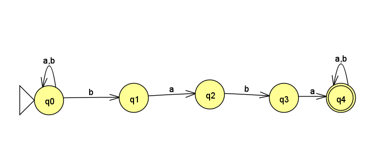
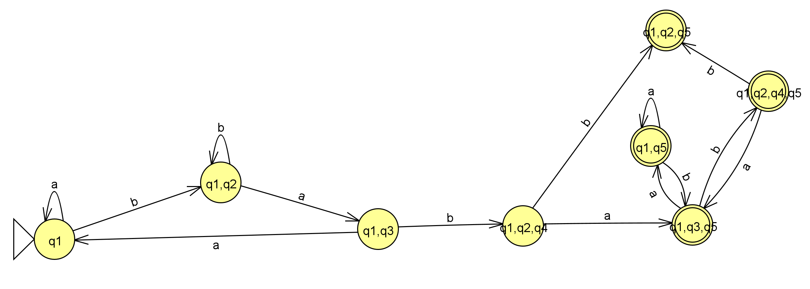

February 20th, 2023

First 20 minutes: Going over converting DFA to NFA- follow the states and create new states as sets of states.

We say that two states are indistinguishable if for two states $p, q: \delta(p, w) \in F \iff \delta(q, w) \in F$. 

We use this fact to convert from the following NFA to a DFA:

Goes to the following DFA (following our method):

This DFA looks very complicated, but a verys imple reduction can be applied. Note that once you enter the final 4 states, you cannot escape. Also note all of those states are accept states. Thus, the final 4 states (all states containing $q_5$) can be combine into a single state. This is how we can simplify very complex automota to much simpler forms.

