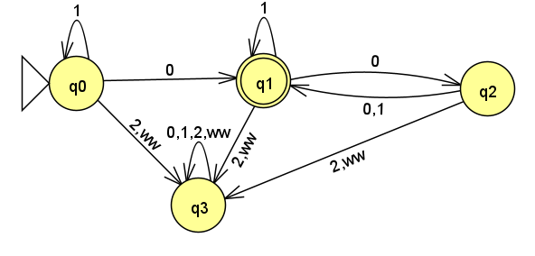
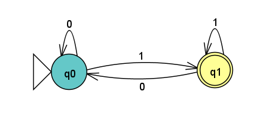
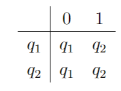

January 20th, 2023

Say we have two languages $\sum$ and $\sum'$.
$$
\sum = \{0,1\} \newline
\sum' = \{0,1,2,ww\}
$$
We want to combine two automota, $M$ and $M'$. To do so, we need to extend the languages of our two automotan to accept each other.

 This is an example of an automotan that has been combined with the automotan from [last class](obsidian://open?vault=CIS%202111&file=Lecture%201%2FLecture).

Now we define a two-state finite automotan $M_2$.

We know a few things about this automotan from this image:

$M_2 = (\{q_1, q_2\}, \{0,1\}, \delta, q_1, \{q_2\})$

where $\delta$ is the transition function - 

 Let's check some codes to see if they belong in the language of $M_2$:
1101 - $q_0 \rightarrow q_1 \rightarrow q_1 \rightarrow q_0 \rightarrow q_1 \therefore$ $q_1$ is a terminal/accepting state, so 1101 is accepted.
110 - $q_0 \rightarrow q_1 \rightarrow q_1 \rightarrow q_0 \therefore$ $q_2$ is not a terminal state, so 110 is NOT accepted.

The language of $M_2$: $(0* 1* 0+ 1}