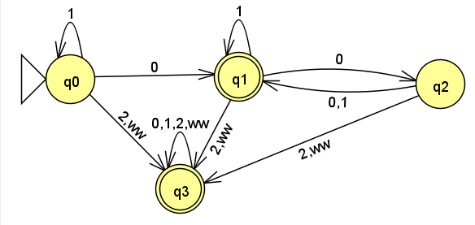

January 20th, 2023

Say we have two languages $\sum$ and $\sum'$.
$$
\sum = \{0,1\} \newline
\sum' = \{0,1,2,ww\}
$$
We want to combine two automota, $M$ and $M'$. To do so, we need to extend the languages of our two automotan to accept each other.

 This is an example of an automotan that has been combined with the automotan from [last class](obsidian://open?vault=CIS%202111&file=Lecture%201%2FLecture).

Now we define a two-state finite automotan $M_2$.

