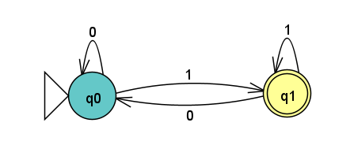
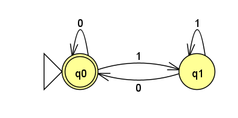
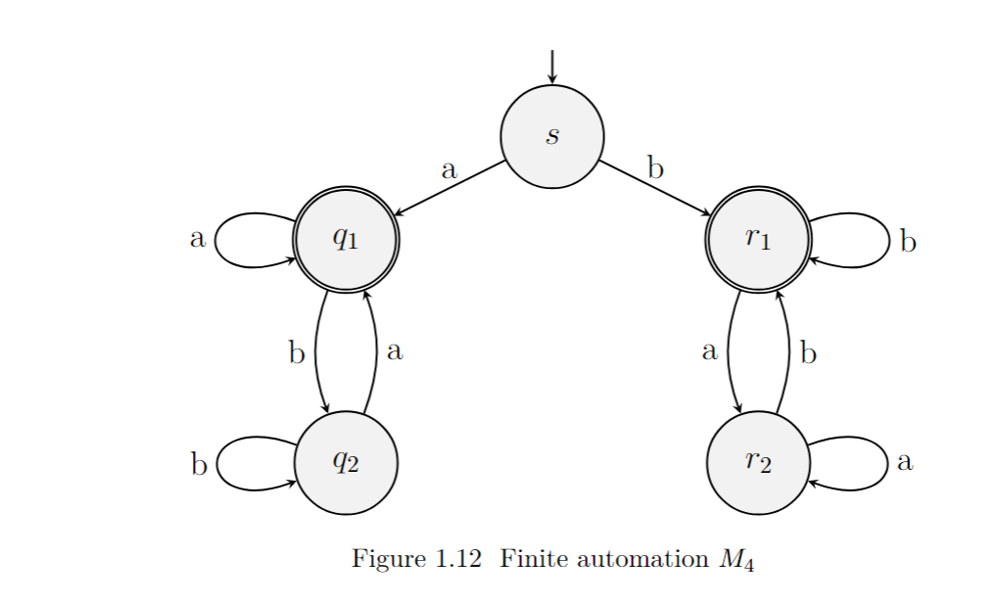
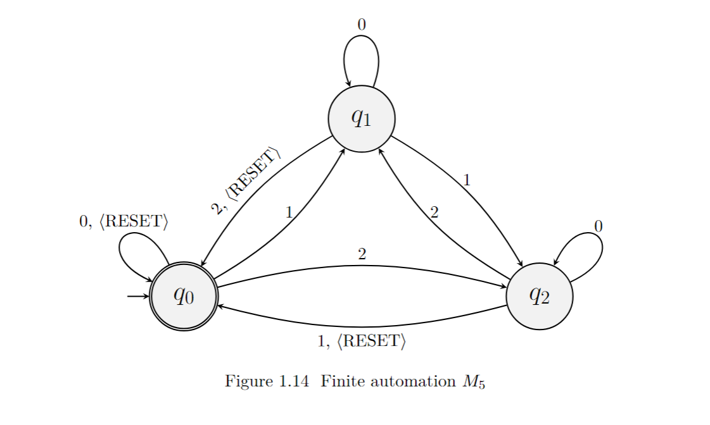
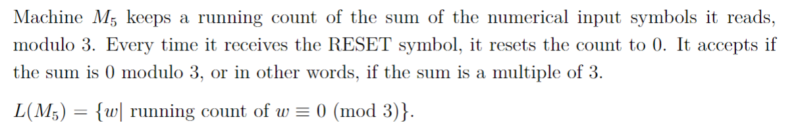
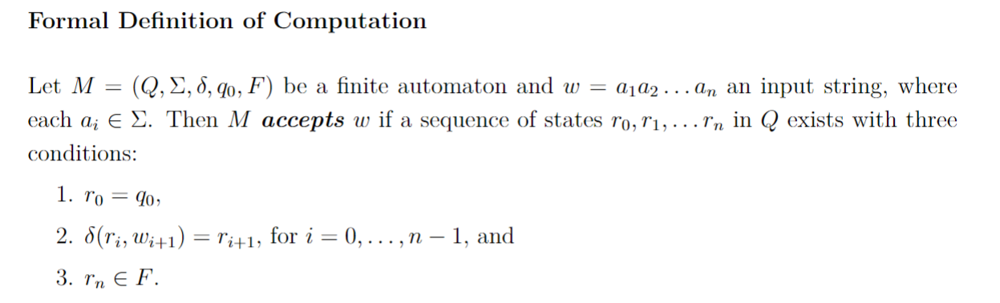

January 23rd, 2023

It is important that every state in an automotan has a transition associated with every member of said automotan's alphabet- this is to ensure that every string within the alphabet can at least be read. Note it is not necessary to <i>accept</i> every string, simply that it is able to <i>read</i> each string.

Quick review:

We already know the language of this automotan- $L(M_2) = \{ w | w \text{ ends in a 1} \}$

Let's make a small alteration, call it $M_3$:

The only change here is the terminal state moving from $q_1$ to $q_0$.

What is the language for $M_3$?

- Start in $q_0$
- any number of 0's will be accepted
- after 1, can have any number of 1's
- 0 has to follow 1

Using these vague descriptions we can say $0^* \cup \{0, 1\}^* \ 1 \ 0^+$
Basically, any number of 0s is valid -> if we input a 1, we absolutely need to terminate with a 0.

$L(M_3) = \epsilon \cup \{0, 1\}^* \ 1 \ 0^+$

$L(M_4) = \{w | w \text{ begins and ends with the same letter} \}$

This last automotan is interesting- it is an automotan that we can use to count numbers mod 3. For example-
$q_0$ -1-> $q_1$ -2-> $q_0$ || The code 1 2 ends back in $q_0$ - notice 1 + 2 = 3 == 0 (mod 3)
2 2 2 || Intuitively, we know that 2+2+2 == 0 (mod 3) || $q_0$ -2-> $q_2$ -2-> $q_1$ -2-> $q_0$

So, this automotan will accept codes that are 0 (mod 3):
$L(M_5) = \{ w | \sum{w} \equiv 0 (\text{mod 3})\}$

A language is called a formal language if some finite automaton recognizes it.

DFA- Deterministic Finite Automaton
- Each Symbol only has 1 edge
NDFA- Non-Deterministic Finite Automaton
- At least 1 pathway exists to the terminal state

<h3> Formal Definition of Computing </h3>

<h2> End Class Notes 1a </h2>

<h3> Regular Operations </h3>

Let A and B be languages. Then, we define the regular operations *union*, *concatenation*, and *the kleene star operation*.

Union- $A \cup B = \{ x | x \in A \vee x \in B \}$
Concatenation- $A \circ B = \{ xy | x \in A \wedge y \in B\}$
Kleene * Operation- $A^* = \{ x_1 x_2 \text{...} x_k \text{| k} \geq 0 \wedge \text{ each } x_i \in A \}$

Turing Machine - Basic Conjecture

Any computation taking place on a regular computer can be simulated on a turing machine.