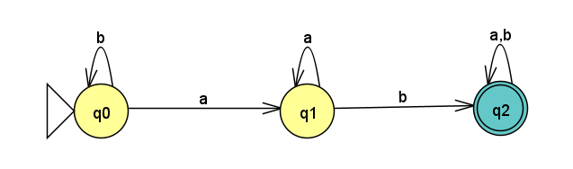
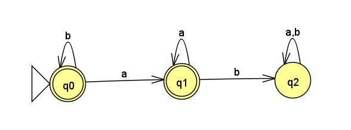
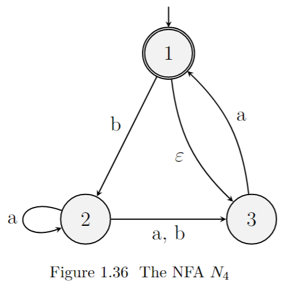
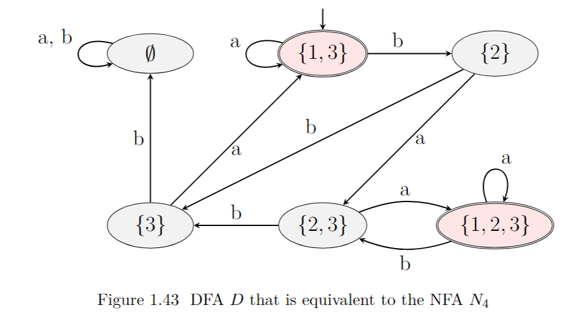
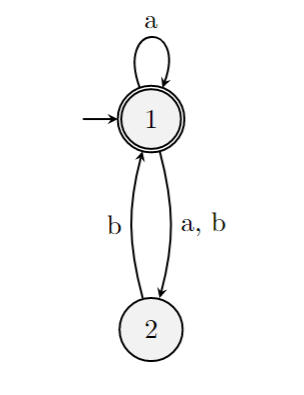
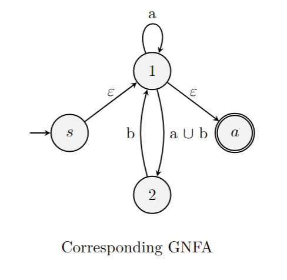

February 6th, 2023

10 minutes late oops

$L(A_1) = \{w \thinspace | \thinspace w \text{ contains ab}\}$ -

$L(A_2) = \{ w \thinspace | \thinspace w \text{ does not contain ab} \}$ -

### DFA Equivalent to NFA

Start with NFA $N_4$:

Goes to this DFA:

### Going from NFA to GNFA to find a regular expression

- First, combine multiple edges as unions
	- a,b becomes $a \cup b$
- Now, add state s and s as start and accept states, s being start and a being accept states.
- One edge goes from s to the original start state (in this case $1$) and one edge goes from the original accept state (in this case $1$) to $a$. Both are epsilon moves.
We recieve this GNFA:

#### Eliminate state 1 from GNFA:
List connected triangles containing state 1: $\{1, s, 2\} \thinspace \{1,s,a\} \thinspace \{1,2,a\}$

### Recognizing a Regular Language

If a language is regular, then we can describe it with a regular expression. So, it is of interest to be able to detect if a language is regular. Enter, the Pumping Lemma.

