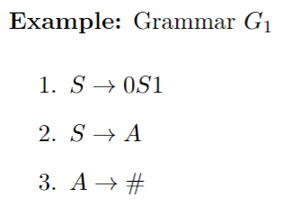
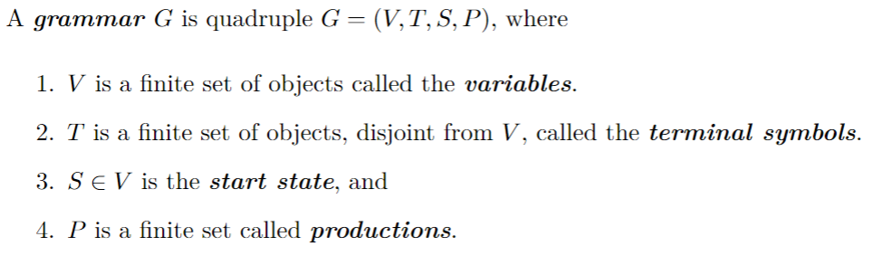

February 10th, 2023

### Context-Free Languages

A grammar consists of a colelction of substitution rules, also called productions. Each rule appears as a line in the grammar, comprising a symbol and a string separated by an arrow. The symobl is called a *variable* and the string is a collection of *terminals*. 
Here is an example of a grammer:

##### Formal Definition of a Grammar

$G_2 = (V, T, S, P)$
$V = \{A, B\}$ and $T = \{a, b\}$
with 

$S \rightarrow AB$
$A \rightarrow aaA|\epsilon$
$B \rightarrow Bb|\epsilon$

$S \rightarrow AB \rightarrow aaAB \rightarrow aaA\epsilon \rightarrow aaaaA \rightarrow aaaa\epsilon \rightarrow aaaa$
$S \overset{*}\rightarrow aaaa$
$\overset *\rightarrow$ means derivation, as in $aaaa$ is derived from $S$.

