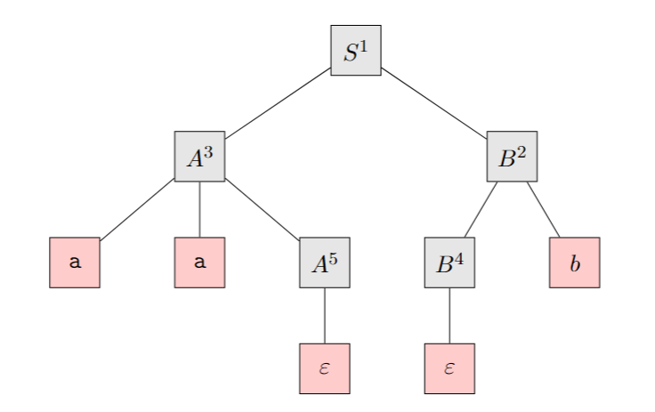

February 10th, 2023

### Context-Free Languages

A grammar consists of a colelction of substitution rules, also called productions. Each rule appears as a line in the grammar, comprising a symbol and a string separated by an arrow. The symobl is called a *variable* and the string is a collection of *terminals*. 
Here is an example of a grammer:

##### Formal Definition of a Grammar

$G_2 = (V, T, S, P)$
$V = \{A, B\}$ and $T = \{a, b\}$
with $P = \{$
	$S \rightarrow AB$
	$A \rightarrow aaA\thinspace|\thinspace\epsilon$
	$B \rightarrow Bb\thinspace|\thinspace\epsilon$
$\}$

Let's use this grammar now.
$S \rightarrow AB \rightarrow aaAB \rightarrow aaA\epsilon \rightarrow aaaaA \rightarrow aaaa\epsilon \rightarrow aaaa$
$S \overset{*}\rightarrow aaaa$
$\overset *\rightarrow$ means derivation, as in $aaaa$ is derived from $S$.

Grammars can be ambiguous, meaning a string may have multiple different derivations. 

##### Derivation Trees

We can use ordered trees to show the derivation of a string in a grammar.

If we wanted to get the steps of the derivation, we can number each node with parent > child like so:

$S \overset 1 \rightarrow AB \overset 2 \rightarrow ABb \overset 3 \rightarrow aaABb \overset 4 \rightarrow aaAb \overset 5 \rightarrow aaB \overset 6 \rightarrow aab$

In ambiguous (bad) grammars, we can have multiple derivations, thus multiple derivation trees. THere is an example in the notes.

Leftmost derivation can be visualized as a preorder tree traversal, and a rightmost derivation corresponds to a postorder traversal.
